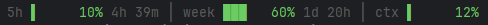
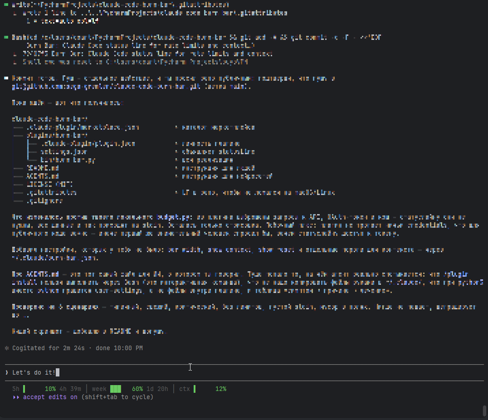

# Burn Bar

A Claude Code status line that shows how much of your budget is left before you
stop being able to work.



And where it lives — one line under the prompt:



Three gauges, left to right:

| Gauge  | What it is                                          |
| ------ | --------------------------------------------------- |
| `5h`   | the 5-hour rate limit, and when it resets            |
| `week` | the 7-day rate limit, and when it resets             |
| `ctx`  | how full the current session's context window is     |

Each gauge is a bar, a percentage, and (for the rate limits) the time left
until that window resets. The bar fills in eighths of a cell, so small changes
are still visible at five characters wide.

Colors follow thresholds: **green** below the warning level, **yellow** past
it, **red** past the stop level. Defaults are 75% / 90% for the rate limits and
80% / 92% for the context window — the context is allowed to run hotter because
filling it is harmless, autocompact just kicks in.

## Install

```
/plugin marketplace add sega-gremlen/claude-code-burn-bar
/plugin install burn-bar@claude-code-burn-bar
```

Requires **Python 3.10+** on your `PATH` as `python`. No packages to install,
no network access, no API token — the plugin only reads the session JSON that
Claude Code hands it on stdin.

If your Python is called `python3` (common on macOS and Linux), see
[Custom Python path](#custom-python-path) below.

## Configuration

Everything is optional. Create `~/.claude/burn-bar.json`:

```json
{
  "warn_pct": 75,
  "stop_pct": 90,
  "context_warn_pct": 80,
  "context_stop_pct": 92,
  "bar_width": 5,
  "show_context": true,
  "show_reset": true
}
```

| Key                 | Default | Meaning                                             |
| ------------------- | ------- | --------------------------------------------------- |
| `warn_pct`          | `75`    | rate-limit percentage that turns the gauge yellow    |
| `stop_pct`          | `90`    | rate-limit percentage that turns the gauge red       |
| `context_warn_pct`  | `80`    | context percentage that turns `ctx` yellow           |
| `context_stop_pct`  | `92`    | context percentage that turns `ctx` red              |
| `bar_width`         | `5`     | bar width in characters                              |
| `show_context`      | `true`  | show the `ctx` gauge at all                          |
| `show_reset`        | `true`  | show the time until each rate limit resets           |

Only the keys you set are overridden; the rest keep their defaults.

## Notes

**The rate limit gauges need a subscription and appear after the first
request.** Claude Code only sends `rate_limits` once it has them, so on a fresh
session the line may briefly show just `ctx`, or a single `…` before any data
arrives. That is expected, not a failure.

**It replaces your existing status line.** A plugin's status line takes effect
when the plugin is enabled. If you already have a `statusLine` in
`~/.claude/settings.json` and want it back, disable the plugin with
`/plugin disable burn-bar` (or remove your own setting to let the plugin win).

**Terminal requirements:** a UTF-8 capable terminal with a font that has block
characters (`█ ▏▎▍▌▋▊▉`) and the box-drawing `│`. Any modern terminal qualifies.
On Windows the script forces UTF-8 output itself.

### Custom Python path

The plugin invokes `python`. If that name does not exist on your system, or you
want a specific interpreter, override the status line in your own
`~/.claude/settings.json` — user settings take precedence:

```json
{
  "statusLine": {
    "type": "command",
    "command": "python3 \"$HOME/.claude/plugins/marketplaces/claude-code-burn-bar/plugins/burn-bar/bin/burn_bar.py\"",
    "padding": 0
  }
}
```

Adjust the path if your plugin install directory differs — `/plugin` shows
where a plugin is installed.

## License

MIT
